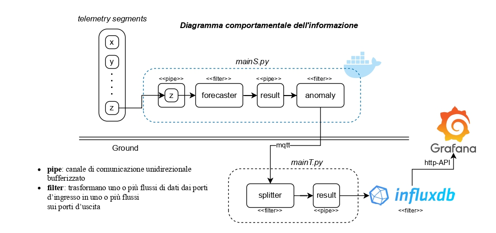

# 🚀 Edge-Based Anomaly Detection in Satellite Telemetry

**Tesi di Laurea Triennale - Università di Pisa**  
**Autore:** Andres Lazzari  
**Anno Accademico:** 2024/2025  
**Relatore:** Dott. Vincenzo Lomonaco

---

## 📌 Descrizione del Progetto

Questo repository contiene il codice e le risorse sviluppate per la mia tesi di laurea: un sistema edge-based per il *forecasting* e il *rilevamento anomalie* su dati di telemetria satellitare.  
Il progetto nasce dall’esigenza di ridurre la latenza e aumentare l’autonomia operativa dei satelliti, rilevando localmente (a bordo) comportamenti anomali in tempo reale.

Il sistema è progettato per operare in contesti computazionalmente limitati (edge computing) e integra modelli fondazionali di nuova generazione, come **Chronos** e **TimeGPT**, con un'infrastruttura completa per la simulazione, la visualizzazione e il benchmarking.



---

## ⚙️ Architettura del Sistema

Il sistema è suddiviso in due moduli principali:

- **Modulo OnBoard (Edge):**
  - Forecasting & Anomaly Detection locale
  - Simulazione dati da canali NASA/OPS-SAT
  - Strategy Pattern per la selezione dinamica dei modelli
  - Containerizzazione con Docker per ambienti a bassa potenza

- **Modulo OnGround (Terra):**
  - Ricezione dati via MQTT
  - Archiviazione in InfluxDB
  - Visualizzazione in tempo reale con Grafana
  - Analisi comparativa tra modelli (Chronos, TimeGPT, modelli non supervisionati)

---

## 📊 Benchmark e Modelli

Sono stati implementati diversi modelli per il confronto delle performance in termini di accuratezza, F1-score, precision, recall:

- ✅ **Modelli Fondazionali**
  - Chronos (AutoGluon-based)
  - TimeGPT (Nixtla)
  
- ⚙️ **Modelli Non Supervisionati**
  - Isolation Forest (IForest)
  - KNN, LOF
  - INNE
  
- 🧠 **Strategie di rilevamento anomalie**
  - Differenze, soglie dinamiche, Z-Score, Mediane mobili, ecc.

Tutti i risultati sono stati salvati in CSV e visualizzati su Grafana per analisi comparative su più canali.

---

## 🛰 Dataset

- **OPS-SAT**: dataset pubblici ESA
- **NASA SMAP**: serie multicanale per test su condizioni reali
- **Simulazione**: supporto per test offline ed esperimenti ripetibili

---

## 🧪 Come Eseguire

> Requisiti:
- Python 3.10+
- Docker & Docker Compose
- librerie: `pandas`, `influxdb-client`, `torch`, `scikit-learn`, `nixtla`, ecc.

```bash
git clone https://github.com/tuo-username/edge-anomaly-detection-sat.git
cd edge-anomaly-detection-sat

# Setup ambiente
pip install -r requirements.txt

# Avvio simulazione e rilevamento
python mainT.py --config config/edge.yaml

# Avvio backend Grafana + InfluxDB
docker-compose up
